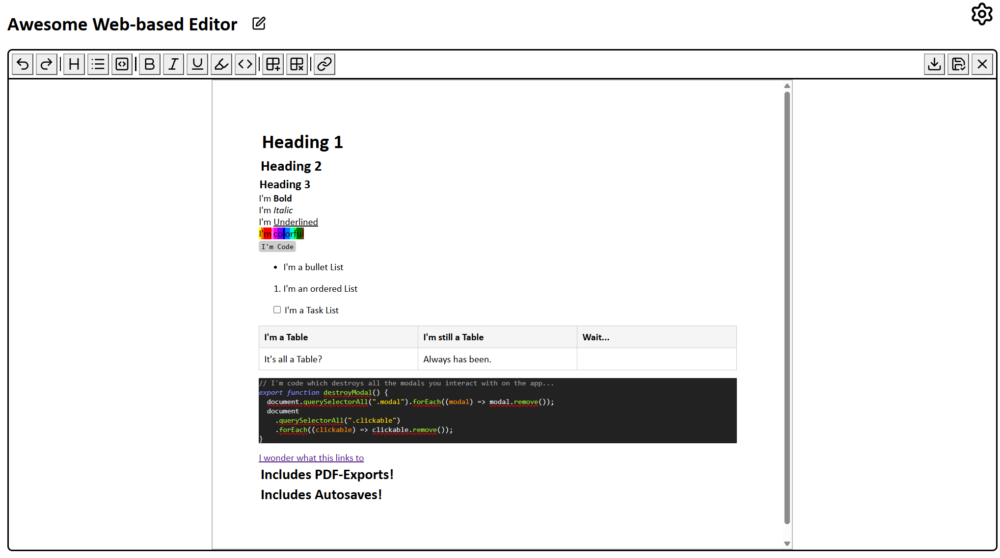

# Editor

This is a Web-based Editor which can run locally or on a home server. The project is powered by an Express and Vite server, with Tiptap extensions powering the editor itself. It's easy to keep your documents organized with a sidebar including as many levels of folders as your heart desires and a search, so that you can always find what you're looking for.

## Contents

- [Features](#features)
- [Installation](#installation)
- [Update Guide](#update-guide)
- [Known Issues](#known-issues)
- [Planned Features](#planned-features)
- [Notes](#notes)

## Features



- Different Styles
  - Headings
  - Lists
  - Code Blocks with Syntax Highlighting
  - Bold
  - Italic
  - Underlined
  - Highlighting
  - Inline Code
  - Tables
  - Links
  - Images (copy-paste)
- Sidebar allowing for easy navigation of the Folder Structure
- Search Bar
- Undo / Redo
- Export Documents as .pdf files.
- Always continue where you left off with URLs for any page.
- Avoid losing Data with Autosaves.
- Configure the app to your liking with the Settings page (WIP).

## Installation

1. Install [Node.js](https://nodejs.org/) and [git](https://git-scm.com/).
2. Clone the repository using `git clone https://github.com/Yooli8537/Editor` or download a recent release and unzip it.
3. Run `npm install` within the repository's directory.
4. Run `npm run dev` and open [http://localhost:8511](http://localhost:8511).

## Known Issues

- Using Firefox will slow down the App a lot, and I don't know why. [Brave](https://brave.com) is a very good alternative to use instead. I don't actively test different browsers, so this may get better over time. (08/26)

### Priority

- Renaming a Folder in which a file is currently open doesn't update the file's path, thus making saving and other operations impossible.
- Sidebar Code is geuinely impossible to understand. 1000 previousentries but they're never defined and all have a different use. Help.

### To be fixed

- Links without https:// (or http://) redirect the user to a nonexistent URL within the application. https:// should be added automatically.
- Can't search with `Enter`.
- When renaming Folders in different directories in a series, the chain eventually breaks and causes a (500) Error.
- Empty Links style as links and link to the root of the app.
- The delete confirmation Modal for a Notebook says its a folder, which is technically correct and is too technically inconvenient to change for me to care.
- Confirmation Modals can't be confirmed with the Enter Key.
- Pasting in Code from Word which was pasted in from VSC or Code copied directly from GitHub makes the line spacing very big.
- Sometimes, most of a Code Block will just be defined as a String by the Syntax highlighting. Likely due to the MD formatting (``````).
- Sometimes, Helptexts appear in the top left corner instead of the spot they should be in. May be another Submenu issue.
- TipTap's emoji Extension doesn't work.
- Files with the same name in different directories will overwrite each other when autosaving. Add support for this, maybe by creating the same folderstructure in the autosaves folder right when a new notebook / folder is created.
- When reloading a page, there's a chance that the `master.json` isn't loaded into the state correctly, thus creating an error.
- When renaming a file, it will likely not recognize its previous autosaves.
- Leaving an unsaved document highlights the newly selected one, even if you press "back".
- Clicking on the already active & unsaved document on the sidebar gives out both an autosave restoration and discard changes modal.
- Importing tables from Excel (and likely other sources) adds an image and a table.

## Planned Features

### Priority

- Refactor Code for the single-function principle
- Full Image support
  - Allow different ways of putting Text around an Image instead of it just not allowing Text next to it.
- Collapsing / Expanding Folders

### Functional

- Backups of previous 5 versions of a document
- Moving folders & files using drag & drop.
- Settings Menu
  - Keybinds
  - Display
    - Dark / Light Mode
    - Amount of Characters before "..."
  - Edit Formats
  - Manage
    - Storage
      - Maximum image size (in mb)
      - Maximum PDF export size
    - Saving config
      - Number of backed-up versions
- Containerization
- Language Selection List for Codeblocks
- Allow the user to save a Document when Discard Button is clicked.
- Advanced Images
  - Label Images
  - Hovering over an Image shows its label.
  - Image labels can be searched through.
  - Different Image positions (left / right)
- Support long names by replacing them with "..." if they get >25 characters long. Cap at 50 instead of 30.

### Cosmetic

- Page separation
- A4 Toggle
- "No Results" message when searching and no results come up.
- Dark Mode
- A nicer 404 page
- Discard Button warning Color

## Notes

- Icons were downloaded from [Lucide](https://lucide.dev/).
- The Editor's functionality comes from [TipTap](https://tiptap.dev/) and its Extensions.
